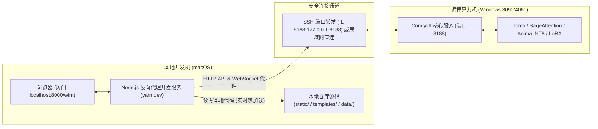
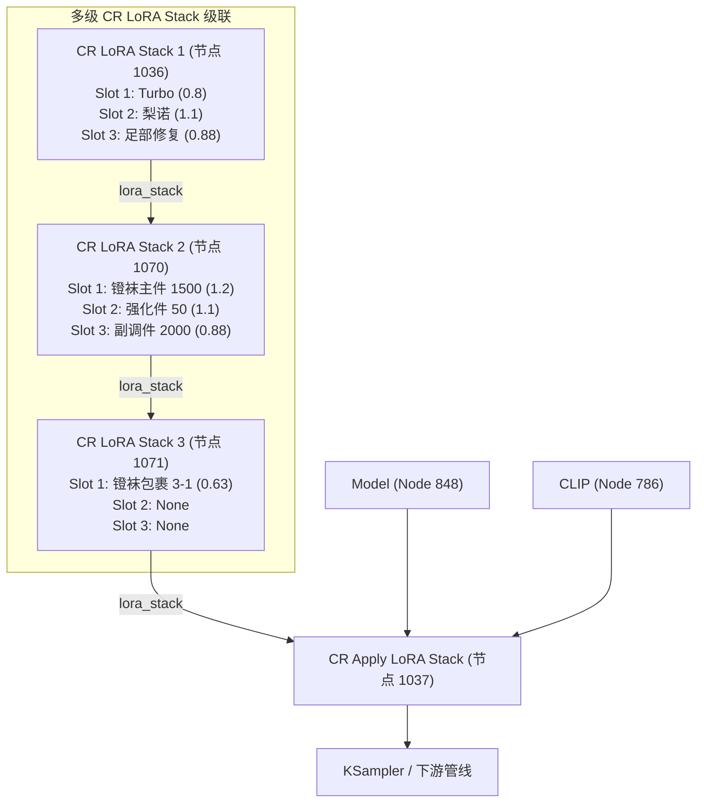

# ComfyUI-Workflow-Studio 教学与架构开发指南

本指南面向需要在本地（如 macOS）进行轻量、高效二次开发，同时使用远程独立 GPU 算力机（如 Windows RTX 3090/4060）进行模型推理和出图的开发者与创作者。

---

## 目录
1. [架构解耦：本地 UI 与远程算力机分离](#1-架构解耦本地-ui-与远程算力机分离)
2. [快速上手：使用 Yarn 启动本地开发服务](#2-快速上手使用-yarn-启动本地开发服务)
3. [故事分镜解析与 LoRA 智能触发机制](#3-故事分镜解析与-lora-智能触发机制)
4. [多 LoRA 精调权重保留与动态级联算法](#4-多-lora-精调权重保留与动态级联算法)
5. [艾尼玛（Anima W8A8 INT8）模型体系支持](#5-艾尼玛anima-w8a8-int8模型体系支持)
6. [前端二次开发规范与代码结构](#6-前端二次开发规范与代码结构)

---

## 1. 架构解耦：本地 UI 与远程算力机分离

### 传统模式的痛点
在传统 ComfyUI 插件开发中，`ComfyUI-Workflow-Studio` 作为 custom node 运行在算力机内部。每当需要修改 HTML、CSS 或 JavaScript 代码时：
1. 必须在本地 commit 并 push 到 Git 仓库；
2. 登录算力机执行 `git pull`；
3. 重启算力机的 ComfyUI 服务（加载耗时 30~60 秒）；
4. 调试效率低下，极其繁琐。

### 解耦开发模式架构
我们将 **Studio 网页端** 与 **ComfyUI 算力引擎** 彻底分离：



- **静态资源完全本地化**：修改 `static/js/*.js`、`static/css/*.css`、`templates/*.html`，浏览器刷新（`Cmd + R`）立即呈现，零等待。
- **无跨域与零配置**：开发服务内置透明代理，所有 `/prompt`、`/ws`、`/object_info`、`/view` 等 ComfyUI 引擎接口同源透传，WebSocket 实时推送生成进度与渲染图。
- **重载计算留在云端**：庞大的检查点模型、量化 UNet、LoRA 与显存管理全部由 Windows 算力机承担。

---

## 2. 快速上手：使用 Yarn 启动本地开发服务

### 前置条件
1. 本地安装了 Node.js（v18+）与 Yarn。
2. 已建立与算力机的端口连通（例如通过 SSH 隧道将远程 8188 映射到本地 8188）：
   ```bash
   ssh -N -L 8188:127.0.0.1:8188 win30902
   ```

### 启动服务
在仓库根目录下执行：
```bash
# 1. 安装依赖 (基于 yarn)
yarn install

# 2. 启动本地独立开发服务 (默认监听 8000 端口，代理到 127.0.0.1:8188)
yarn dev
```

如果远程算力机在局域网其它 IP 或指定端口，可通过参数指定：
```bash
yarn dev --port 8080 --comfy-url http://192.168.1.100:8188
```

启动成功后，浏览器直接打开：
👉 **`http://localhost:8000/wfm`**

---

## 3. 故事分镜解析与 LoRA 智能触发机制

### 分镜文本标准格式（`LN*.txt`）
系统原生支持混合分镜格式，包含特征标签与自然语言场景描述：
```text
[tags]
1girl, liino \(arknights\), blonde hair, (white stirrup legwear:1.3), stirrupjob, ustirrup, footjob

[caption]
Liino props one shoulder against the backstage hallway wall, tease smile with one eye closed...
[/caption]
```

### 智能匹配流程
1. **结构切分**：提取 `[tags]` 标签和 `[caption]` 描述；若用户未显式书写 `[tags]`，解析器自动将 `[caption]` 前的内容归类为正向标签。
2. **全文关键词检索**：对包含别名、下划线、括号的标签进行模糊规范化（例如 `liino`、`stirrupjob`、`@footrepair`、`cervical`）。
3. **规则优先匹配**：根据 `data/lora_rules.json` 中的预设规则匹配出需要激活的自训 LoRA。
4. **冗余步数抑制**：自动扫描目录中若存在同一训练集的其它 checkpoint（例如 `stirrupjob-000051`、`000081`），系统会自动标记为非激活（`active: false`），防止参数互相冲淡，确保画面质量精准受控。

---

## 4. 多 LoRA 精调权重保留与动态级联算法

### 核心设计原则
在角色动作与特殊体位绘制中，单一 LoRA 往往难以达到极致质感，通常需要组合多个微调模型并分别施加精细权重：
- **角色 LoRA**：`lino_v2.safetensors`（权重 1.1）
- **修复 LoRA**：`anima_footRepair_v2.safetensors`（权重 0.88）
- **主动作 LoRA**：`ustirrup-step00001500.safetensors`（权重 1.2）
- **强化动作 LoRA**：`stirrupjob-000050.safetensors`（权重 1.1）
- **副调动作 LoRA**：`ustirrup-step00002000.safetensors`（权重 0.88）
- **鞋履形态 LoRA**：`stirrup3-1.safetensors`（权重 0.63）
- **加速 LoRA**：`anima-turbo-lora-v0.2.safetensors`（权重 0.8）

### CR LoRA Stack 动态级联算法
ComfyUI 原生 `CR LoRA Stack` 每个节点仅能容纳 3 个 LoRA 槽位。当匹配出的 LoRA 数量超过 3 个时，系统后端（`py/services/lora_trigger_service.py`）采用自动分块级联注入：



- **无碰撞 ID 分配**：新增的级联节点使用 `max_existing_id + 1` 自动命名，完全不影响工作流原有节点连接。
- **纯前端直通**：用户在 Studio 界面可以直接对每个匹配出来的 LoRA 标签微调 Model 权重与 Clip 权重，或一键开关/移除单个 LoRA，点击【立即写入工作流】或在点击【Generate】时全自动静默应用。

---

## 5. 艾尼玛（Anima W8A8 INT8）模型体系支持

### 为什么标准 Checkpoint 机制会识别错误？
Anima 模型通常经量化转换后以 UNet 形式运行，使用 `OTUNetLoaderW8A8` 节点加载 `silvermoonmixAnima_v23_INT8.safetensors`。原版 Studio 会因检测不到常规 `CheckpointLoaderSimple` 而报错或错误匹配其它 SDXL 模型。

### 适配机制
1. **工作流分析器升级 (`workflow_analyzer.py` & `comfyui-workflow.js`)**：
   - 将 `OTUNetLoaderW8A8` 纳入 `diffusion_model_nodes` 检索树。
   - 提取参数 `unet_name`，识别出 Anima 家族模型。
2. **GenerateUI 顶部徽章**：
   - 在主界面顶部工具栏高亮显示：
     `UNet (INT8/Anima): silvermoonmixAnima_v23_INT8.safetensors`
   - 明确标注当前运行的是 Anima 量化模型，避免误导。

---

## 6. 前端二次开发规范与代码结构

### 关键代码分布
| 文件路径 | 模块职责 |
| :--- | :--- |
| `tools/dev-server.js` | 本地轻量 Node.js 开发代理服务（支持 HTTP & WebSocket 双向透传） |
| `package.json` | 前端项目工程定义，统一使用 `yarn` 管理依赖与脚本 |
| `static/js/gen-presets.js` | 生成预设管理 UI（一键切换单/双采样、参数装配、保存弹窗） |
| `static/js/prompt-story-lora.js` | 分镜导入解析、LoRA 芯片组件渲染、权重调整与规则弹窗 |
| `static/js/comfyui-workflow.js` | 工作流分析器、UI 格式与 API 格式互转、节点 Bypass 逻辑 |
| `static/js/generate-tab.js` | Generate 选项卡核心控制器，负责生成前拦截并注入 LoRA |
| `py/services/gen_presets_service.py` | 预设持久化存储与工作流参数一键装配（采样器/调度器/LoRA） |
| `py/services/lora_trigger_service.py` | 触发词扫描、正则分镜提取、CR LoRA Stack 串联分配算法 |
| `data/gen_presets.json` | 用户与系统预设库文件 |
| `data/lora_rules.json` | 持久化自训 LoRA 触发词与精调权重数据库 |

---

## 7. 生成预设体系（Generation Presets）与自动化规范

为避免创作者与 AI 助手反复手动调整采样步数、CFG、单双采样切换与 LoRA 权重，系统引入了全局预设机制。

### 内置核心预设
1. **⚡ Anima 单采样极速 (`anima-single-turbo`)**：
   - 模式：`single`（单采样）
   - 步数与 CFG：`steps: 12`, `cfg: 1.6`, `sampler: euler_ancestral`, `scheduler: beta57`
   - 搭配 LoRA：Turbo 0.8 + 美学高清提升 0.48
   - 适用：日常快速分镜审图，1~2秒快速出图且画面结构工整。
2. **🎭 Anima 双层精细采样 (`anima-two-stage-standard`)**：
   - 模式：`double`（双层采样）
   - 第一层（粗采）：`steps: 5`, `cfg: 4.6`, `sampler: er_sde`, `scheduler: simple`
   - 第二层（精修）：`steps: 12`, `cfg: 1.6`, `sampler: dpmpp_2m_sde_gpu`, `scheduler: beta57`
   - 适用：多角色、复杂透视和大场景精细刻画。
3. **🎨 Anima 原生全扩散 (`anima-native-30`)**：
   - 模式：`single`（单采样无 Turbo）
   - 步数与 CFG：`steps: 30`, `cfg: 4.0`, `sampler: er_sde`, `scheduler: beta57`
   - 适用：追求传统纯扩散厚重笔触和渐变质感。
4. **🦶 梨诺镫袜足交全套混合 (`liino-footjob-suite`)**：
   - 装配经过反复验证的 6 个特定 LoRA 及其实测黄金权重比例。

### 创作者保存与 AI 调用方式
- **网页端操作**：在 GenerateUI 顶部点击【💾 保存当前】，输入预设名即可将当前界面调试好的步数、CFG 和 LoRA 权重固化为新预设。
- **AI 助手直接调用**：后续只需向 `POST /api/wfm/gen_presets/apply` 发送预设 ID，即可一键把全部最佳参数装配进工作流，彻底免去繁琐的手动调试！
